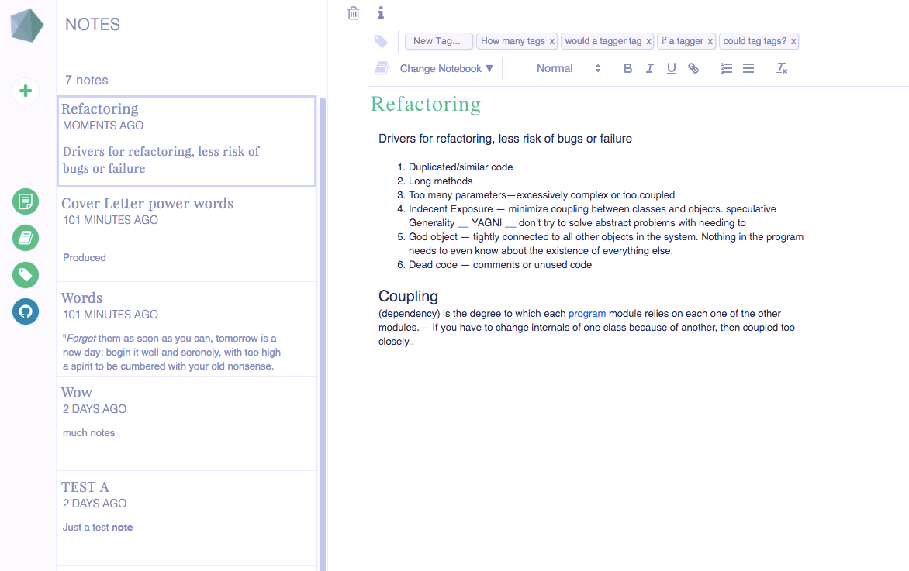

#  Denote

FullStack Web application built with:

 * React  / Redux
 * Rails
 * PostgreSQL
 * SCSS


 Heroku Link : https://denote.herokuapp.com/


Denote is a note categorization application inspired by Evernote. Users can compile collections of notes in notebooks, and apply taggings to notes. The application takes strides to remain faithful to the Evernote experience, with a similar layout and styling.


### Key features

 * User authentication
 * Users can create, view, edit, and delete notes
 * Notes can be organized into collections (notebooks)
 * Rich text editing enabled for a better note taking experience


### UI / UX
 
The project was designed around Evernote's existing hierarchy of components, however the implementation was completely original. No styling libraries were involved either, all visible elements (besides perhaps ReactModal) were styled by hand.


### Taking advantage of React and Redux

This app was designed and implemented keeping the core methodologies of these technologies in mind. The state of Denote is stored in an object tree within a single store. This state is read only, and changes are made using pure functions.




### Notebooks and Notes
A large part of this undertaking was not just constructing the components that make up the application, but making use off them as a whole in an efficient manner. This was taken care of by limiting which pieces of the state were being fetched and when, as well as making data only available to the pieces of the application that needed it.

A number of reducers and selectors were implemented like so:

```javascript
const mapStateToProps = (state, ownProps) => {

  const notebookPath = parseInt(ownProps.match.params.notebookId);

//selector grabbing notes as an array
  const notesState = selectAllNotes(state);

//Grab notes belonging to this notebook
  const notes = notesState.filter((el) =>
    el.notebook_id === notebookPath
  );
  const notebook = state.notebooks[notebookPath];
  const notebooks = state.notebooks;
  return {
//Pass along what is needed to the connected component
    notes,
    notebook,
    notebooks
  };
};
```


##### Future features:
Next steps for Denote involve implementing the following:
 * Autosave
 * Search
 * Reminders
 * Additional UX - friendly animations
